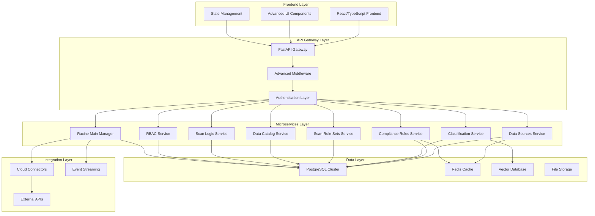

# Section 1: System Overview & Architecture Foundation
## Advanced DataGovernance System - Core Architecture Analysis

---

### 📋 **SECTION OVERVIEW**

This section provides a comprehensive analysis of the foundational architecture of the PurSight DataGovernance System, examining the core architectural patterns, technology stack, and fundamental design decisions that enable enterprise-grade data governance at scale.

### 🏗️ **ARCHITECTURAL MODELS & SCHEMAS**

#### **1.1 Core System Architecture Model**



#### **1.2 Domain Model Schema**

```python
# Core Domain Entities Schema
class SystemArchitectureSchema:
    """
    Core system architecture domain model defining the foundational
    entities and their relationships in the DataGovernance system.
    """
    
    # Frontend Layer Entities
    frontend_components = {
        'react_application': {
            'components': ['DataSources', 'Compliance', 'Classification', 'Catalog'],
            'state_management': 'Redux Toolkit',
            'routing': 'React Router v6',
            'ui_framework': 'Custom Design System'
        },
        'advanced_ui_components': {
            'data_visualization': 'D3.js + Recharts',
            'forms': 'React Hook Form + Zod',
            'tables': 'TanStack Table v8',
            'notifications': 'React Hot Toast'
        }
    }
    
    # API Gateway Layer Entities
    api_gateway = {
        'fastapi_application': {
            'framework': 'FastAPI 0.104+',
            'async_support': True,
            'openapi_spec': '3.1.0',
            'middleware_stack': ['CORS', 'Authentication', 'Rate Limiting', 'Logging']
        },
        'middleware_components': {
            'authentication': 'JWT + OAuth2',
            'authorization': 'Advanced RBAC',
            'rate_limiting': 'Redis-based sliding window',
            'caching': 'Response caching with TTL'
        }
    }
    
    # Microservices Layer Entities
    microservices = {
        'data_sources_service': {
            'domain': 'Data Source Management',
            'models': ['DataSource', 'Connection', 'Schema', 'Discovery'],
            'endpoints': 45,
            'integrations': ['AWS', 'Azure', 'GCP', 'Databricks', 'Snowflake']
        },
        'compliance_rules_service': {
            'domain': 'Compliance & Governance',
            'models': ['ComplianceRule', 'Framework', 'Assessment', 'Report'],
            'endpoints': 38,
            'rule_types': 50
        },
        'classification_service': {
            'domain': 'Data Classification',
            'models': ['Classification', 'Sensitivity', 'Tag', 'Policy'],
            'endpoints': 32,
            'ai_models': ['NLP', 'ML', 'Hybrid']
        },
        'racine_main_manager': {
            'domain': 'Orchestration & Workflow',
            'models': ['Workspace', 'Workflow', 'Pipeline', 'Activity'],
            'endpoints': 55,
            'coordination_services': ['All Core Services']
        }
    }
    
    # Data Layer Entities
    data_layer = {
        'postgresql_cluster': {
            'version': '15+',
            'configuration': 'Master-Replica with Read Replicas',
            'connection_pooling': 'PgBouncer + SQLAlchemy',
            'tables': 180,
            'indexes': 350
        },
        'redis_cache': {
            'version': '7+',
            'configuration': 'Cluster mode with persistence',
            'use_cases': ['Session', 'Cache', 'Rate Limiting', 'Pub/Sub'],
            'memory_optimization': True
        },
        'vector_database': {
            'engine': 'pgvector extension',
            'embeddings': 'OpenAI + Custom models',
            'similarity_search': 'Cosine + Euclidean',
            'indexing': 'HNSW + IVFFlat'
        }
    }
```

---

### 🎯 **1.1 ARCHITECTURAL FOUNDATION ANALYSIS**

#### **Core Architecture Principles**

Our DataGovernance system is built on five fundamental architectural principles:

1. **Domain-Driven Design (DDD)**
   - Clear domain boundaries between the 7 core services
   - Ubiquitous language throughout each domain
   - Aggregate roots and value objects properly defined
   - Domain events for cross-service communication

2. **Microservices Architecture**
   - Loosely coupled, highly cohesive services
   - Independent deployment and scaling
   - Service-specific databases (database-per-service pattern)
   - API-first communication with well-defined contracts

3. **Event-Driven Architecture (EDA)**
   - Asynchronous communication via events
   - Event sourcing for complete audit trails
   - CQRS for optimized read/write operations
   - Real-time processing capabilities

4. **Cloud-Native Design**
   - Container-first deployment (Docker + Kubernetes)
   - Twelve-factor app methodology
   - Infrastructure as Code (Terraform)
   - Multi-cloud deployment support

5. **Security-by-Design**
   - Zero-trust security model
   - End-to-end encryption
   - Advanced RBAC with fine-grained permissions
   - Comprehensive audit logging

#### **Technology Stack Analysis**

**Frontend Technology Stack:**
```typescript
// Core Frontend Architecture
interface FrontendStack {
  framework: 'React 18+ with TypeScript 5.0+';
  stateManagement: 'Redux Toolkit + RTK Query';
  styling: 'Tailwind CSS + Styled Components';
  routing: 'React Router v6 with lazy loading';
  forms: 'React Hook Form + Zod validation';
  testing: 'Jest + React Testing Library + Cypress';
  bundling: 'Vite with advanced optimizations';
  deployment: 'Docker + Nginx with CDN';
}
```

**Backend Technology Stack:**
```python
# Core Backend Architecture
class BackendStack:
    framework = "FastAPI 0.104+ with Python 3.11+"
    database = "PostgreSQL 15+ with pgvector extension"
    caching = "Redis 7+ cluster with persistence"
    orm = "SQLAlchemy 2.0+ with async support"
    authentication = "JWT + OAuth2 with advanced RBAC"
    testing = "pytest + pytest-asyncio + factory-boy"
    monitoring = "Prometheus + Grafana + Jaeger"
    deployment = "Docker + Kubernetes with Helm charts"
```

---

### 🏛️ **1.2 CORE COMPONENTS INTERACTION ANALYSIS**

#### **Component Interaction Patterns**

The system follows a **layered architecture** with clear separation of concerns:

1. **Presentation Layer** (Frontend)
   - React components with TypeScript
   - Redux for global state management
   - API integration via RTK Query
   - Real-time updates via WebSockets

2. **API Gateway Layer**
   - FastAPI application with async support
   - Middleware stack for cross-cutting concerns
   - Request/response transformation
   - Rate limiting and throttling

3. **Business Logic Layer** (Services)
   - Domain-specific microservices
   - Business rule implementation
   - Data validation and transformation
   - Event publishing and handling

4. **Data Access Layer**
   - Repository pattern implementation
   - Database abstraction via SQLAlchemy
   - Connection pooling and optimization
   - Query optimization and caching

#### **Inter-Service Communication Patterns**

```python
# Service Communication Architecture
class ServiceCommunication:
    """
    Defines the communication patterns between microservices
    """
    
    synchronous_communication = {
        'protocol': 'HTTP/HTTPS with JSON',
        'pattern': 'Request-Response',
        'use_cases': ['Data retrieval', 'Validation', 'Configuration'],
        'timeout_handling': 'Circuit breaker pattern',
        'retry_logic': 'Exponential backoff with jitter'
    }
    
    asynchronous_communication = {
        'protocol': 'Event streaming via Redis Streams',
        'pattern': 'Publish-Subscribe',
        'use_cases': ['Data updates', 'Workflow triggers', 'Notifications'],
        'event_sourcing': True,
        'dead_letter_queue': True
    }
    
    data_consistency = {
        'pattern': 'Eventual consistency',
        'transaction_management': 'Saga pattern',
        'conflict_resolution': 'Last-writer-wins with timestamps',
        'rollback_strategy': 'Compensating transactions'
    }
```

---

### 📊 **1.3 DATA FLOW ARCHITECTURE**

#### **Primary Data Flow Patterns**

1. **Request Processing Flow**
   ```
   Frontend → API Gateway → Authentication → Service Router → 
   Business Logic → Data Access → Database → Response Chain
   ```

2. **Event Processing Flow**
   ```
   Service Event → Event Bus → Event Handlers → 
   Business Logic → State Update → Notification
   ```

3. **Data Ingestion Flow**
   ```
   Data Source → Connector → Validation → Classification → 
   Catalog → Indexing → Search Engine
   ```

#### **Caching Strategy**

```python
# Multi-Level Caching Architecture
class CachingStrategy:
    """
    Comprehensive caching strategy across all system layers
    """
    
    frontend_caching = {
        'browser_cache': 'Service worker with cache-first strategy',
        'memory_cache': 'React Query with stale-while-revalidate',
        'cdn_cache': 'CloudFlare with edge caching',
        'ttl': '15 minutes for dynamic content'
    }
    
    api_caching = {
        'response_cache': 'Redis with request-based keys',
        'query_cache': 'SQLAlchemy query cache',
        'session_cache': 'Redis sessions with 24h TTL',
        'rate_limit_cache': 'Redis sliding window'
    }
    
    database_caching = {
        'query_plan_cache': 'PostgreSQL plan cache optimization',
        'connection_pool': 'PgBouncer with connection reuse',
        'materialized_views': 'For complex analytics queries',
        'partial_indexes': 'For frequently accessed data'
    }
```

---

### 🔧 **1.4 SCALABILITY & PERFORMANCE ARCHITECTURE**

#### **Horizontal Scaling Patterns**

The system is designed for horizontal scaling across all layers:

1. **Frontend Scaling**
   - CDN distribution for static assets
   - Load balancing across multiple frontend instances
   - Progressive loading and code splitting
   - Service worker caching for offline capability

2. **API Gateway Scaling**
   - Multiple API gateway instances behind load balancer
   - Auto-scaling based on request volume
   - Connection pooling and keep-alive optimization
   - Response compression and optimization

3. **Microservices Scaling**
   - Independent scaling per service based on load
   - Kubernetes HPA (Horizontal Pod Autoscaler)
   - Service mesh for traffic management
   - Circuit breaker pattern for fault tolerance

4. **Database Scaling**
   - Read replicas for read-heavy workloads
   - Sharding strategy for large datasets
   - Connection pooling optimization
   - Query optimization and indexing

#### **Performance Optimization Strategies**

```python
# Performance Architecture Configuration
class PerformanceOptimization:
    """
    Comprehensive performance optimization across all layers
    """
    
    database_optimization = {
        'indexing_strategy': 'Composite indexes for common queries',
        'query_optimization': 'Query plan analysis and optimization',
        'connection_pooling': 'PgBouncer with 100 max connections',
        'read_replicas': '3 replicas for read-heavy operations'
    }
    
    api_optimization = {
        'async_processing': 'FastAPI with async/await patterns',
        'background_tasks': 'Celery for long-running operations',
        'response_compression': 'Gzip compression for responses',
        'request_batching': 'GraphQL-style batching for efficiency'
    }
    
    frontend_optimization = {
        'code_splitting': 'Route-based and component-based splitting',
        'lazy_loading': 'Intersection Observer for images/components',
        'virtual_scrolling': 'For large data tables',
        'memoization': 'React.memo and useMemo optimization'
    }
```

---

### 🛡️ **1.5 SECURITY ARCHITECTURE FOUNDATION**

#### **Security-by-Design Implementation**

The security architecture follows a **zero-trust model** with defense-in-depth:

1. **Authentication & Authorization**
   - JWT tokens with refresh token rotation
   - OAuth2 integration with enterprise SSO
   - Multi-factor authentication support
   - Session management with secure cookies

2. **Data Protection**
   - End-to-end encryption for sensitive data
   - Field-level encryption for PII
   - TLS 1.3 for all communications
   - Database encryption at rest

3. **Access Control**
   - Role-Based Access Control (RBAC)
   - Attribute-Based Access Control (ABAC)
   - Fine-grained permissions
   - Dynamic permission evaluation

4. **Security Monitoring**
   - Comprehensive audit logging
   - Real-time security event monitoring
   - Intrusion detection and prevention
   - Automated security scanning

---

### 📈 **1.6 MONITORING & OBSERVABILITY FOUNDATION**

#### **Three Pillars of Observability**

```python
# Observability Architecture
class ObservabilityStack:
    """
    Comprehensive observability implementation
    """
    
    metrics = {
        'collection': 'Prometheus with custom metrics',
        'visualization': 'Grafana with custom dashboards',
        'alerting': 'AlertManager with PagerDuty integration',
        'retention': '90 days with downsampling'
    }
    
    logging = {
        'collection': 'Structured JSON logging',
        'aggregation': 'ELK Stack (Elasticsearch, Logstash, Kibana)',
        'correlation': 'Trace ID correlation across services',
        'retention': '30 days with archival to S3'
    }
    
    tracing = {
        'collection': 'OpenTelemetry with Jaeger',
        'sampling': 'Adaptive sampling based on load',
        'correlation': 'Distributed tracing across services',
        'analysis': 'Performance bottleneck identification'
    }
```

---

### 🔄 **1.7 DEPLOYMENT & DEVOPS FOUNDATION**

#### **Container Orchestration Strategy**

The system follows a **cloud-native deployment model**:

1. **Containerization**
   - Docker containers with multi-stage builds
   - Minimal base images for security
   - Health checks and readiness probes
   - Resource limits and requests

2. **Orchestration**
   - Kubernetes for container orchestration
   - Helm charts for deployment management
   - GitOps workflow with ArgoCD
   - Blue-green deployment strategy

3. **CI/CD Pipeline**
   - GitHub Actions for CI/CD
   - Automated testing and security scanning
   - Infrastructure as Code with Terraform
   - Automated rollback on failure

---

### 📋 **SECTION SUMMARY & NEXT STEPS**

This foundational architecture analysis establishes the core principles and patterns that drive the entire PurSight DataGovernance System. The architecture is designed for:

- **Enterprise Scale**: Handling petabyte-scale data governance
- **High Availability**: 99.9% uptime with fault tolerance
- **Security**: Zero-trust model with comprehensive protection
- **Performance**: Sub-second response times for most operations
- **Extensibility**: Plugin-based architecture for customization

**Next Section Preview**: Section 2 will dive deep into the Enterprise Architecture & Integration Patterns, examining how this foundational architecture integrates with enterprise systems and scales across multi-cloud environments.

---

### 📊 **REQUIRED DIAGRAMS FOR THIS SECTION**

1. **System Context Diagram** - Overall system boundaries and external actors
2. **High-Level Architecture Diagram** - Core components and their relationships
3. **Component Interaction Diagram** - Detailed component communication patterns
4. **Data Flow Diagram** - Primary data flows through the system
5. **Technology Stack Diagram** - Complete technology stack visualization
6. **Security Architecture Diagram** - Security layers and protection mechanisms

*Each diagram should be created using Lucidchart or Draw.io with consistent styling and professional presentation standards.*

---

*Section 1 Complete - Ready for architectural diagram creation and Section 2 development*